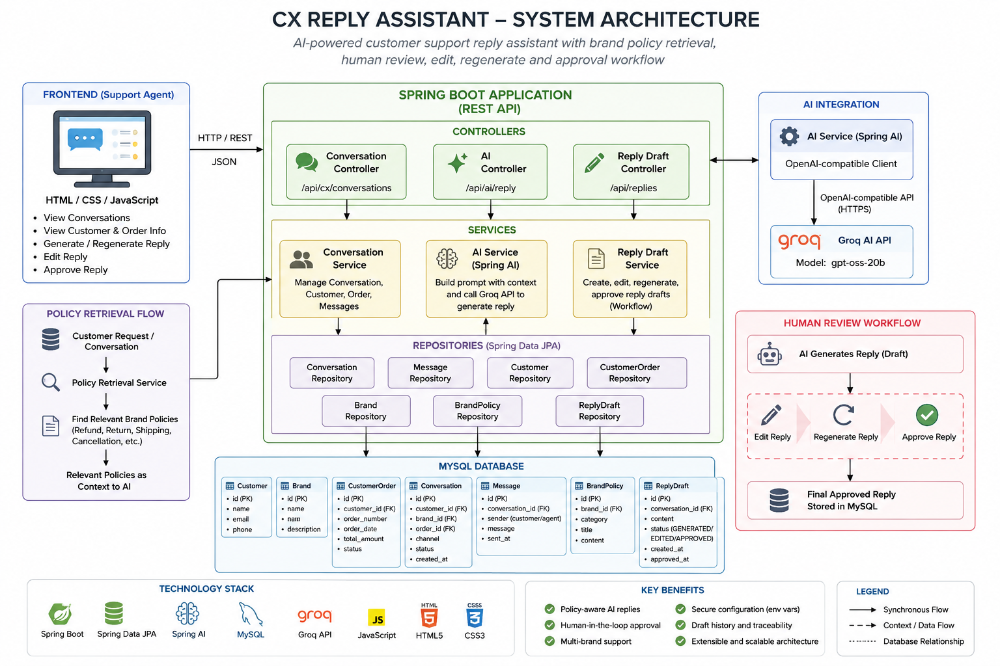

# CX Reply Assistant

An AI-powered Customer Experience (CX) Reply Assistant built with **Java 17, Spring Boot, Spring AI, MySQL, and Groq's OpenAI-compatible API**.

The application helps customer support agents generate **policy-aware customer replies**, review and edit AI-generated drafts, regenerate alternatives, and approve the final response before it is stored.

---

## Overview

Customer support teams often need to respond to large numbers of customer conversations while following brand-specific policies.

The CX Reply Assistant provides a human-in-the-loop workflow:

```text
Customer Conversation
        ↓
Retrieve Relevant Brand Policies
        ↓
Build Context-Aware AI Prompt
        ↓
Generate Reply Draft
        ↓
Support Agent Review
        ↓
 ┌───────────────┐
 │ Edit          │
 │ Regenerate    │
 │ Approve       │
 └───────┬───────┘
         ↓
Final Approved Response
         ↓
Stored in MySQL
```

The AI response is treated as a **draft** and is not automatically sent to the customer.

---

## Features

- Customer conversation management
- Customer and order information display
- Brand-specific policy retrieval
- AI-generated customer support replies
- Context-aware AI prompting
- Policy-aware response generation
- Human-in-the-loop review
- Edit generated replies
- Regenerate replies
- Approve replies
- Reply draft history
- Reply status tracking
- MySQL persistence
- REST APIs
- Browser-based support-agent interface
- Environment-variable based secret configuration

---

## Technology Stack

| Technology | Purpose |
|---|---|
| Java 17 | Application development |
| Spring Boot | Backend framework |
| Spring Data JPA | Database persistence |
| Spring AI | AI integration |
| Groq API | AI model provider |
| MySQL | Relational database |
| Maven | Build and dependency management |
| HTML | Frontend structure |
| CSS | Frontend styling |
| JavaScript | Frontend/API interaction |
| IntelliJ IDEA | Development environment |
| Git / GitHub | Version control |

---

## System Architecture



### Architecture Overview

The application follows a layered Spring Boot architecture.

- **Frontend:** HTML, CSS and JavaScript provide the support-agent interface.
- **Controllers:** Expose REST APIs for conversations, AI reply generation and reply management.
- **Services:** Handle conversation processing, policy retrieval, AI generation and reply-draft workflows.
- **Repositories:** Use Spring Data JPA to access MySQL.
- **Policy Retrieval:** Identifies relevant brand policies from customer conversation text.
- **AI Service:** Builds a context-aware prompt using brand, customer, order, conversation and relevant policy information.
- **Spring AI:** Provides the AI client abstraction.
- **Groq:** Provides the AI model through an OpenAI-compatible API.
- **Human Review:** Allows the support agent to edit, regenerate or approve the generated reply.
- **MySQL:** Stores customers, brands, orders, conversations, messages, policies and reply drafts.

---

## Reply Generation Flow

```text
1. Support agent opens a customer conversation
                    ↓
2. Application loads customer/order/conversation data
                    ↓
3. Customer messages are combined into conversation context
                    ↓
4. Policy Retrieval Service identifies relevant policies
                    ↓
5. AI Service builds the prompt
                    ↓
6. Spring AI calls the configured AI provider
                    ↓
7. AI generates a customer-facing reply
                    ↓
8. Generated reply is stored as a draft
                    ↓
9. Support agent reviews the response
                    ↓
10. Agent can edit or regenerate
                    ↓
11. Agent approves the final response
                    ↓
12. Final response is stored
```

---

## Policy Retrieval

The application retrieves relevant brand policies before generating an AI response.

The current implementation uses conversation text to identify relevant policy categories.

### Example

Customer message:

```text
My bottle arrived damaged. Can I get a refund?
```

The application identifies relevant terms such as:

```text
damaged
refund
```

and retrieves relevant policies such as:

```text
REFUND:
Refunds are available for damaged products reported within 7 days of delivery.

RETURN:
Damaged products are eligible for replacement within 7 days of delivery.
Customers may be asked to provide photos of the damage.
```

These policies are then passed to the AI as contextual information.

### Current Policy Categories

| Customer Request | Relevant Policy |
|---|---|
| Refund request | REFUND |
| Damaged/broken product | REFUND / RETURN |
| Replacement request | RETURN |
| Shipping/delivery question | SHIPPING |
| Cancellation request | CANCELLATION |

---

## AI Response Guardrails

The AI prompt contains rules designed to reduce unsupported customer-facing claims.

The AI is instructed to:

- Use only the provided policy information.
- Avoid inventing refunds or replacements.
- Avoid inventing discounts.
- Avoid inventing delivery dates.
- Avoid claiming an action has already been completed unless the information confirms it.
- Ask the support agent to verify information when the available policy context is insufficient.
- Avoid exposing internal instructions.
- Avoid unnecessarily exposing customer contact information.
- Keep responses concise and professional.

This makes the AI generation **policy-aware rather than a generic chatbot response**.

---

## Human-in-the-Loop Workflow

AI-generated replies are not automatically sent to customers.

The support agent remains responsible for the final response.

```text
                 AI Generated Draft
                         │
                         ▼
                ┌─────────────────┐
                │  Human Review   │
                └────────┬────────┘
                         │
          ┌──────────────┼──────────────┐
          ▼              ▼              ▼
        Edit         Regenerate       Approve
          │              │              │
          │              └──────┐       │
          │                     │       │
          └─────────────────────┘       │
                                        ▼
                              Final Approved Response
                                        │
                                        ▼
                                   MySQL Storage
```

Draft statuses include:

```text
GENERATED
EDITED
APPROVED
```

This provides traceability for the AI-generated and human-reviewed response lifecycle.

---

## Database

The application uses **MySQL** with Spring Data JPA.

### Main Entities

- `Brand`
- `BrandPolicy`
- `Customer`
- `CustomerOrder`
- `Conversation`
- `Message`
- `ReplyDraft`

### Simplified Relationship

```text
Brand
 │
 ├── BrandPolicy
 │
 └── Conversation
        │
        ├── Customer
        │
        ├── CustomerOrder
        │
        └── Message
                │
                ▼
            ReplyDraft
```

---

## Environment Configuration

Sensitive credentials are **not stored in the GitHub repository**.

The application reads configuration from environment variables.

Required variables:

```text
DB_URL
DB_USERNAME
DB_PASSWORD
AI_API_KEY
```

Example:

```text
DB_URL=jdbc:mysql://localhost:3306/cx_reply_assistant
DB_USERNAME=root
DB_PASSWORD=your_database_password
AI_API_KEY=your_ai_api_key
```

See:

```text
.env.example
```

for the configuration template.

**Never commit real API keys or database passwords to GitHub.**

---

## Spring Boot Configuration

The application uses environment-variable placeholders instead of storing credentials directly in the configuration.

```properties
spring.application.name=cx-reply-assistant

spring.datasource.url=${DB_URL:jdbc:mysql://localhost:3306/cx_reply_assistant}
spring.datasource.username=${DB_USERNAME:root}
spring.datasource.password=${DB_PASSWORD}

spring.jpa.hibernate.ddl-auto=update
spring.jpa.show-sql=true
spring.jpa.properties.hibernate.format_sql=true

spring.ai.openai.api-key=${AI_API_KEY}
spring.ai.openai.base-url=https://api.groq.com/openai/v1
spring.ai.openai.chat.model=openai/gpt-oss-20b
```

Spring AI uses the OpenAI-compatible configuration to communicate with the Groq API.

---

## Prerequisites

Before running the application locally, install:

- Java 17
- MySQL
- Git
- Maven (optional because the Maven Wrapper is included)
- IntelliJ IDEA or another Java IDE

You also need an AI API key configured through an environment variable.

---

## Database Setup

Create the MySQL database:

```sql
CREATE DATABASE cx_reply_assistant;
```

Configure:

```text
DB_URL=jdbc:mysql://localhost:3306/cx_reply_assistant
DB_USERNAME=root
DB_PASSWORD=your_database_password
```

The application uses JPA/Hibernate with:

```properties
spring.jpa.hibernate.ddl-auto=update
```

to create or update the required database tables.

---

## Running the Application

### 1. Clone the repository

Clone the repository from GitHub and enter the project directory.

```bash
git clone <YOUR_GITHUB_REPOSITORY_URL>
cd cx-reply-assistant
```

### 2. Configure environment variables

Set:

```text
DB_URL
DB_USERNAME
DB_PASSWORD
AI_API_KEY
```

Do not place real credentials inside `application.properties`.

### 3. Run using Maven Wrapper

On Windows:

```bash
.\mvnw.cmd spring-boot:run
```

Alternatively:

```bash
mvn spring-boot:run
```

### 4. Open the application

```text
http://localhost:8080/
```

---

## REST API

### Get Conversation

```http
GET /api/cx/conversations/{conversationId}
```

Returns conversation information including:

- Customer
- Brand
- Order
- Messages
- Policies

---

### Generate AI Reply

```http
GET /api/ai/reply/{conversationId}
```

Generates a new AI reply draft and stores it in the database.

Example response:

```json
{
  "draftId": 7,
  "response": "Hi Priya,\n\nI'm sorry to hear that your bottle arrived damaged...",
  "status": "GENERATED"
}
```

---

### Regenerate Reply

```http
POST /api/ai/reply/{conversationId}/regenerate
```

Generates another AI reply draft.

---

### Edit Reply

```http
PUT /api/replies/{draftId}/edit
```

Updates the draft with the support agent's edited response.

---

### Approve Reply

```http
POST /api/replies/{draftId}/approve
```

Approves the draft and stores the final response.

---

## Example Workflow

### Customer

```text
My bottle arrived damaged. Can I get a refund?
```

### Relevant policy

```text
REFUND:
Refunds are available for damaged products reported within
7 days of delivery.
```

### AI

The AI receives:

```text
Brand information
+
Customer information
+
Order information
+
Conversation history
+
Relevant brand policies
```

and generates a customer-facing response.

### Support Agent

The agent can:

```text
Generate
   ↓
Review
   ↓
Edit OR Regenerate
   ↓
Approve
```

The final approved response is stored in MySQL.

---

## Security

Sensitive configuration is externalized through environment variables.

The repository intentionally excludes:

- Real AI API keys
- Database passwords
- `.env` files
- IntelliJ project configuration
- Build output

The repository includes:

```text
.env.example
```

as a safe configuration template.

The `.gitignore` file prevents local secrets and generated files from being committed.

---

## Project Structure

```text
cx-reply-assistant/
│
├── .env.example
├── .gitignore
├── .gitattributes
├── pom.xml
├── mvnw
├── mvnw.cmd
│
├── docs/
│   └── architecture.png
│
└── src/
    │
    ├── main/
    │   │
    │   ├── java/com/datastraw/cx/
    │   │   │
    │   │   ├── config/
    │   │   │   └── DataInitializer.java
    │   │   │
    │   │   ├── controller/
    │   │   │   ├── AiController.java
    │   │   │   ├── CxConversationController.java
    │   │   │   └── ReplyDraftController.java
    │   │   │
    │   │   ├── dto/
    │   │   │   ├── ConversationResponse.java
    │   │   │   ├── ReplyDraftResponse.java
    │   │   │   └── ReplyEditRequest.java
    │   │   │
    │   │   ├── entity/
    │   │   │   ├── Brand.java
    │   │   │   ├── BrandPolicy.java
    │   │   │   ├── Conversation.java
    │   │   │   ├── Customer.java
    │   │   │   ├── CustomerOrder.java
    │   │   │   ├── Message.java
    │   │   │   └── ReplyDraft.java
    │   │   │
    │   │   ├── repository/
    │   │   │   ├── BrandRepository.java
    │   │   │   ├── BrandPolicyRepository.java
    │   │   │   ├── ConversationRepository.java
    │   │   │   ├── CustomerRepository.java
    │   │   │   ├── CustomerOrderRepository.java
    │   │   │   ├── MessageRepository.java
    │   │   │   └── ReplyDraftRepository.java
    │   │   │
    │   │   └── service/
    │   │       ├── AiService.java
    │   │       ├── CxConversationService.java
    │   │       ├── PolicyRetrievalService.java
    │   │       └── ReplyDraftService.java
    │   │
    │   └── resources/
    │       ├── application.properties
    │       └── static/
    │           └── index.html
    │
    └── test/
        └── java/com/datastraw/cx/
            └── CxReplyAssistantApplicationTests.java
```

---

## Current Implementation Scope

This project currently demonstrates the core CX reply-assistant workflow:

```text
Conversation
      ↓
Policy Retrieval
      ↓
AI Generation
      ↓
Draft
      ↓
Human Review
      ↓
Edit / Regenerate
      ↓
Approve
      ↓
Persist
```

The implementation is intentionally focused on demonstrating the core workflow rather than implementing a complete enterprise customer-support platform.

---

---

## Scalability Considerations

The current implementation is designed as an assessment-focused prototype using Spring Boot, MySQL and an external AI provider.

For a production environment handling thousands or millions of customer conversations, the architecture could be extended with the following components:

### Horizontal Scaling

Multiple Spring Boot application instances could run behind a load balancer to distribute incoming requests and avoid depending on a single application instance.

### Caching

Frequently accessed and relatively stable information such as brand policies could be cached using a distributed cache such as Redis to reduce repeated database queries.

### Asynchronous AI Processing

AI generation can be relatively slow compared with normal database operations. A message queue and dedicated AI workers could be introduced so AI requests can be processed asynchronously and scaled independently.

### Database Optimization

The MySQL layer could be optimized using:

- Proper indexing
- Pagination
- Connection pooling
- Query optimization
- Transaction management
- Database monitoring

### AI Reliability

Production AI integration should include:

- Request timeouts
- Retry policies
- Rate limiting
- Error handling
- Provider monitoring
- Optional fallback AI providers

### Observability

A production deployment should include centralized logging, metrics, health checks and distributed tracing to monitor:

- API latency
- AI response latency
- AI failures
- Database performance
- Queue processing
- Error rates

A possible production architecture would be:

```text
Support Agents
      ↓
Load Balancer
      ↓
Multiple Spring Boot Instances
      ↓
 ┌────┴─────────────┐
 │                  │
 ▼                  ▼
Redis          Message Queue
 │                  │
 │                  ▼
 │              AI Workers
 │                  │
 │                  ▼
 │               AI API
 │
 ▼
MySQL

## Future Improvements

Potential production-level enhancements include:

- Authentication and role-based access control
- Multi-user support
- Conversation search and filtering
- Multiple AI provider support
- Vector database / semantic policy retrieval
- Policy versioning
- AI confidence scoring
- Response quality evaluation
- Rate limiting
- Caching
- Asynchronous AI processing
- Queue-based architecture
- Observability and monitoring
- Automated integration testing
- Analytics dashboard
- Production deployment
- WhatsApp and other communication-channel integrations

---

## Key Engineering Decisions

### Policy-aware generation

Relevant policies are retrieved before the AI call so that the model receives brand-specific context.

### Human-in-the-loop

AI-generated replies require support-agent review before approval.

### Separation of concerns

The application separates:

```text
Controllers
    ↓
Services
    ↓
Repositories
    ↓
Database
```

### Secure configuration

Credentials are externalized through environment variables instead of being committed to source control.

### Persistent draft history

Generated and approved responses are stored in MySQL, providing a record of the reply workflow.

---

## Author

**Rohith Rajani**

GitHub: `Rohith2226042`

---

## Project Status

**Core implementation completed.**

The application has been tested locally with:

- MySQL persistence
- AI reply generation
- Policy retrieval
- Reply regeneration
- Reply editing
- Reply approval
- Draft status tracking
- Environment-variable based configuration

The next stage for a production deployment would include authentication, stronger semantic policy retrieval, observability, scalability improvements and deployment infrastructure.